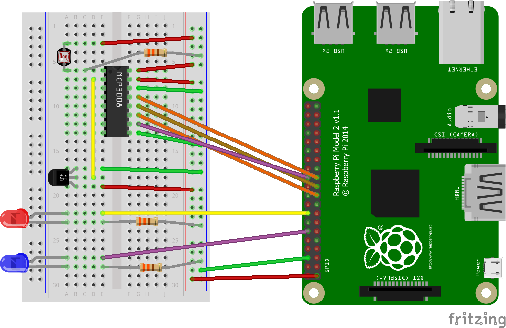

# IoTLab-Base

You need to bring this device, assembled, coded and running to the '**Intro To Azure IoT Central with Windows IoT Core on the Raspberry Pi**' Hands on Lab as it is the starting point for the Lab.  In the two previous hands on labs '**Intro To Azure IoT Central with Windows IoT Core on the Raspberry Pi**' and '**Intro To Sensors with Windows IoT Core on the Raspberry Pi (Feel the Force Luke)**' we covered all the material required to assemble, code, debug and run this device so I won’t be going over any of that in the third lab as we have ton of new material to cover making this an Internet of Things device.

**IoTLab Device**

**Parts List**

| ADC1          | MCP3008 ADC Chip         |
| ------------- | ------------------------ |
| LED1          | Red LED                  |
| LED2          | Blue LED                 |
| R1            | PHOTOCELL                |
| R1            | 330Ω Resistor            |
| R2            | 330Ω Resistor            |
| R3            | 330Ω Resistor            |
| Raspberry Pi1 | Raspberry Pi 2           |
| U1            | TMP36 Temperature Sensor |

Note I don't care what color LED's, wire colors, layout, etc, you use, just that the device is assembled and running before you attend the lab.